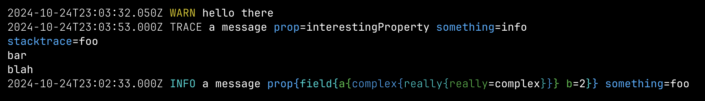

# jsonlogprint

Logs in JSON format are great for machines but super annoying for people.

`jsonlogprint` formats JSON logs for humans, ideally actually better than
plain text logs through judicious use of syntax and color.

For example, these log lines:

```text
{"timestamp": 1729811012050, "level": "WARN", "message": "hello there"}
{"timestamp": 1729811033000, "level": "TRACE", "msg": "a message", "prop": "interestingProperty", "stacktrace": "foo\nbar\nblah", "something": "info"}
{"timestamp": 1729810953000, "level": "INFO", "msg": "a message", "prop": {"field": {"a": {"complex": {"really": {"really": "complex"}}}, "b": 2}}, "something": "foo"}
```

get formatted like this:



## Usage

Just pipe jsonline formatted content through `jsonlogprint`:

```console
$ make run-program | jsonlogprint
```

There are some options that you can provide to jsonlogprint to
speed it up or change the output, but in general it should work
fine with no options.

## Installation

Via curl:

```bash
curl --proto '=https' --tlsv1.2 -LsSf https://github.com/quodlibetor/jsonlogprint/releases/latest/download/jsonlogprint-installer.sh | sh
```

Via homebrew:

```bash
brew install quodlibetor/tap/jsonlogprint
```

## Goals and related work

This project is _not_ for slicing and dicing logs, it is only to make
it easy to read logs with no configuration.

PRs which improve compatibility, output, or performance related to that
goal are very welcome.

If you want to analyze, parse, or filter logs consider:

- [angle-grinder](https://github.com/rcoh/angle-grinder)
- [fastgron](https://github.com/adamritter/fastgron)
- [hl](https://github.com/pamburus/hl)
- [lnav](https://lnav.org/)

many, many others.
